# Projeto de Interface

O projeto de interface tem como objetivo estruturar visualmente a interação entre o usuário e a aplicação, garantindo uma navegação clara, acessível e alinhada aos objetivos do sistema. Ele abrange a definição do fluxo de navegação do usuário (user flow) e a elaboração dos wireframes das principais telas.

A construção das interfaces foi guiada pelos requisitos funcionais, não funcionais e histórias de usuário abordados nas [Documentação de Especificação](especification.md).
Os wireframes apresentados a seguir demonstram como as funcionalidades foram distribuídas nas telas, priorizando a usabilidade, a coerência visual e a eficiência na execução das tarefas pelos usuários.

## User Flow

| |
|:--------------------------------------------------------------------------------------------:|
| **Figura 1: Fluxo do Usuário (User Flow)**                                                  |

## Wireframes

São protótipos usados em design de interface para sugerir a estrutura de um site web e seu relacionamentos entre suas páginas. Um wireframe web é uma ilustração semelhante do layout de elementos fundamentais na interface e é fundamental sempre relacionar cada wireframe com o(s) requisito(s) que ele atende.

### Tela de login

|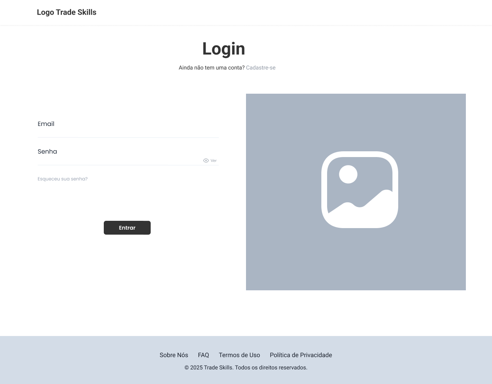|
|:--------------------------------------------------------------------------------------------:|
| **Figura 2: Tela de login**   

| **Componente**               | **Requisitos Atendidos**                                                                 |
|------------------------------|------------------------------------------------------------------------------------------|
| **Tela de login**              | RF01:	Permitir o login por e-mail e senha.   RF03: Permitir a recuperação de senha, mediante confirmação de e-mail e resposta de segurança.|

### Tela de cadastro

|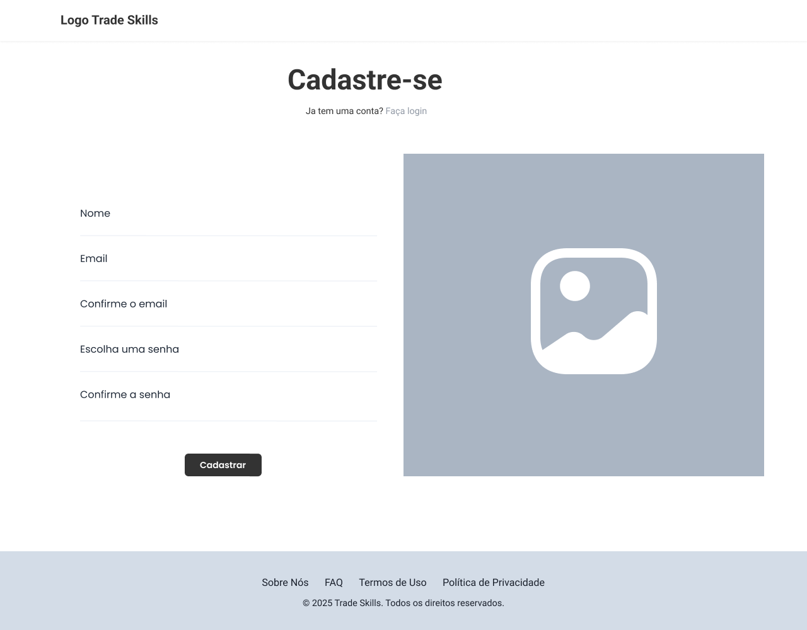|
|:--------------------------------------------------------------------------------------------:|
| **Figura 3: Tela de cadastro**   

| **Componente**               | **Requisitos Atendidos**                                                                 |
|------------------------------|------------------------------------------------------------------------------------------|
| **Tela de Cadastro**              | RF02:	Permitir o cadastro com nome, e-mail e senha.|

### Tela inicial - Dashboard (Primeiro acesso - Desbloqueio de créditos iniciais) 

|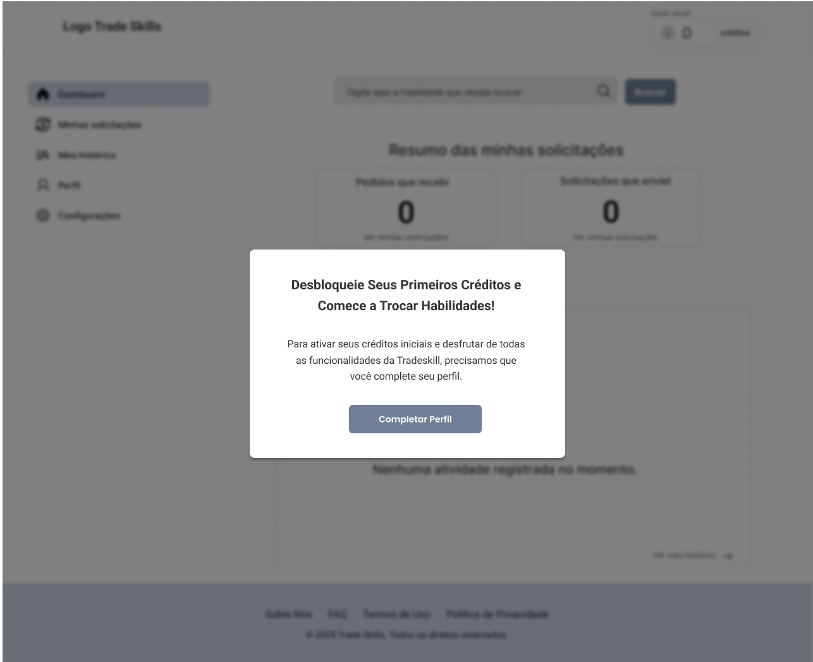|
|:--------------------------------------------------------------------------------------------:|
| **Figura 5: Tela inicial - Dashboard (Primeiro acesso)**   

| **Componente**               | **Requisitos Atendidos**                                                                 |
|------------------------------|------------------------------------------------------------------------------------------|
| **Tela inicial - Dashboard (Primeiro acesso)**              | RF04: Liberar os créditos iniciais de “boas-vindas”, mediante a conclusão do preenchimento dos dados do perfil e configuração da pergunta/resposta de segurança.|

### Tela de perfil - Edição de dados pessoais

|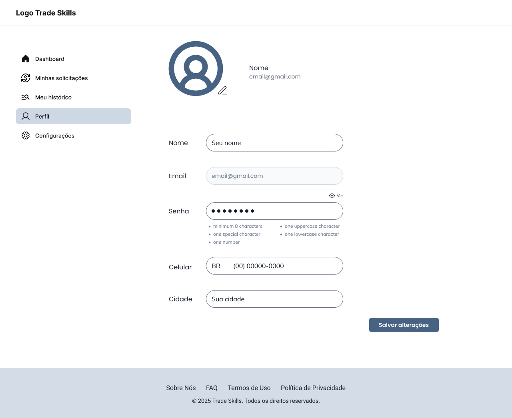|
|:--------------------------------------------------------------------------------------------:|
| **Figura 6: Tela de pefil - Edição de dados pessoais**   

| **Componente**               | **Requisitos Atendidos**                                                                 |
|------------------------------|------------------------------------------------------------------------------------------|
| **Tela de pefil - Edição de dados pessoais**              | RF05: Permitir a edição dos dados pessoais, incluindo: nome, senha, foto, cidade, contato.|

### Tela de perfil - Edição de habilidades

|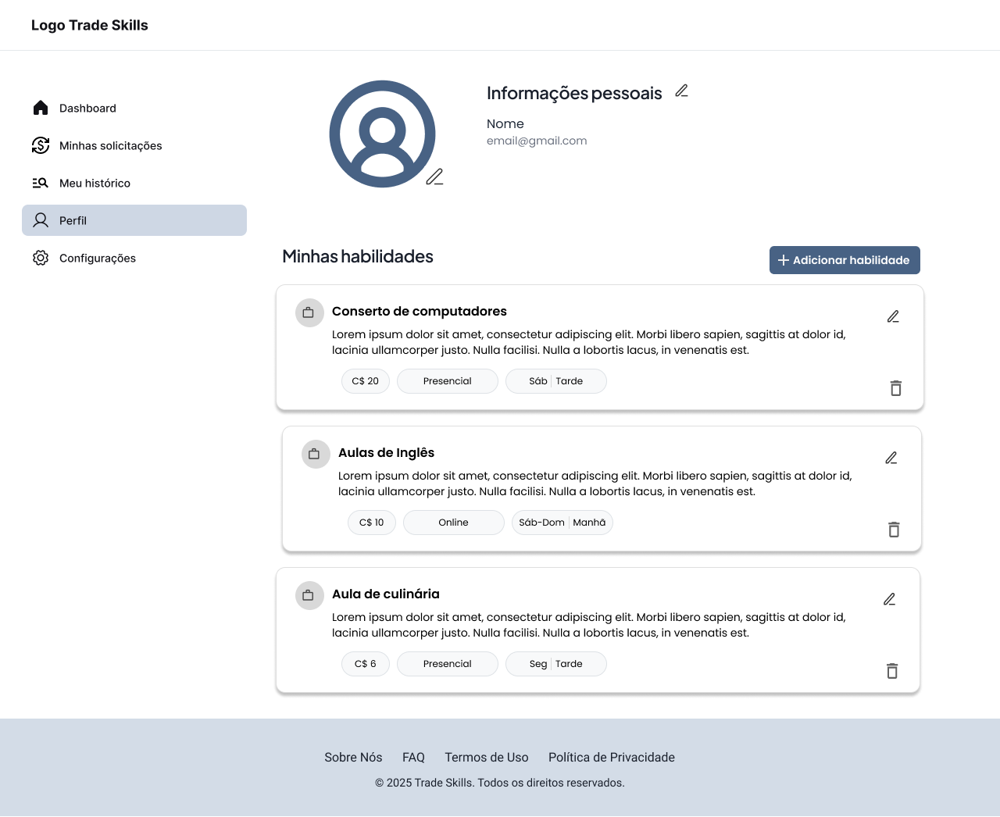|
|:--------------------------------------------------------------------------------------------:|
| **Figura 7: Tela de perfil - Edição de habilidades**   

| **Componente**               | **Requisitos Atendidos**                                                                 |
|------------------------------|------------------------------------------------------------------------------------------|
| **Tela de Perfil - Edição de habilidades**              | RF06: Permitir a edição das habilidades, incluindo título, descrição, valor sugerido em créditos, horário e forma de atendimento (remoto, presencial ou ambos).  RF07: Permitir a exclusão as habilidades cadastradas.|

### Tela de configuração de segurança

|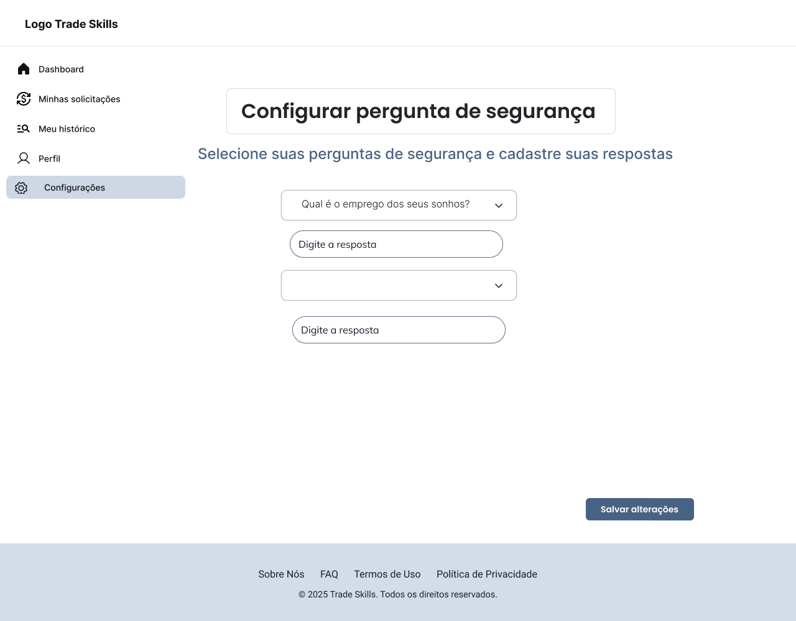|
|:--------------------------------------------------------------------------------------------:|
| **Figura 8: Tela de configuração de segurança**   

| **Componente**               | **Requisitos Atendidos**                                                                 |
|------------------------------|------------------------------------------------------------------------------------------|
| **Tela de configuração de segurança**              | RF08: Permitir a criação de, no mínimo 1 e no máximo 2 perguntas e respostas de segurança, para garantir a possibilidade de recuperar a senha, em caso de esquecimento.|

### Tela inicial - Dashboard

|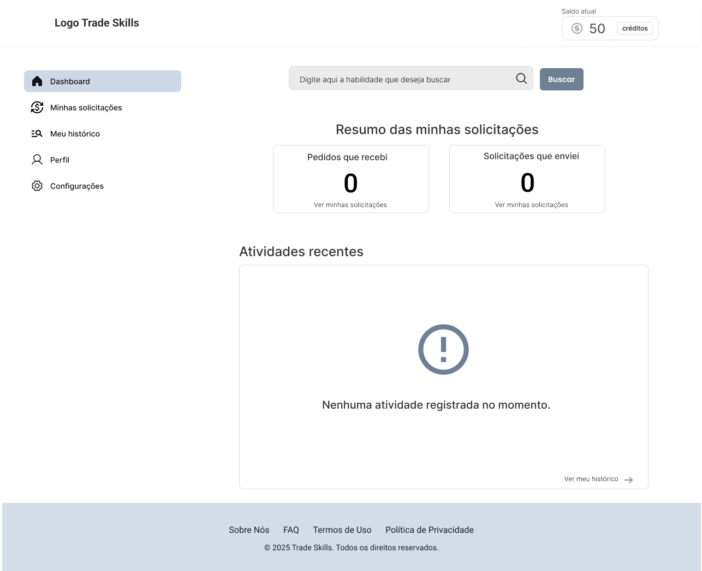|
|:--------------------------------------------------------------------------------------------:|
| **Figura 9: Tela inicial - Dashboard**   

| **Componente**               | **Requisitos Atendidos**                                                                 |
|------------------------------|------------------------------------------------------------------------------------------|
| **Tela inicial - Dashboard**              | RF09: Permitir que a visualização do saldo atual de créditos no cabeçalho do site.  RF14: Permitir a visualização do resumo das atividades do usuário como provedor (pedidos recebidos) e como consumidor (solicitações enviadas).|

### Tela Inicial - Busca por habilidades

|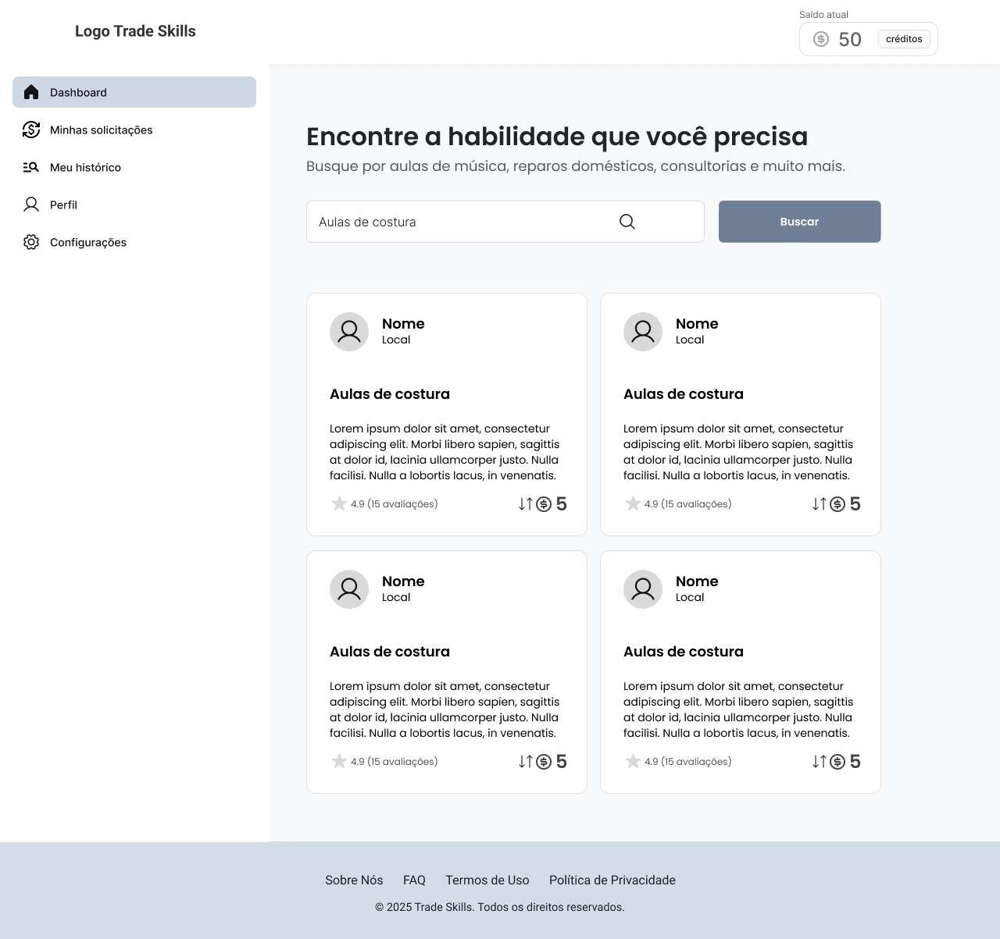|
|:--------------------------------------------------------------------------------------------:|
| **Figura 10: Tela Inicial - Busca por habilidades**   

| **Componente**               | **Requisitos Atendidos**                                                                 |
|------------------------------|------------------------------------------------------------------------------------------|
| **Tela Inicial - Busca por habilidades**              | RF11: Permitir a busca por habilidades desejadas, usando filtros como categoria, reputação do provedor e palavras-chave.|

### Tela Inicial - Visualização de perfis

|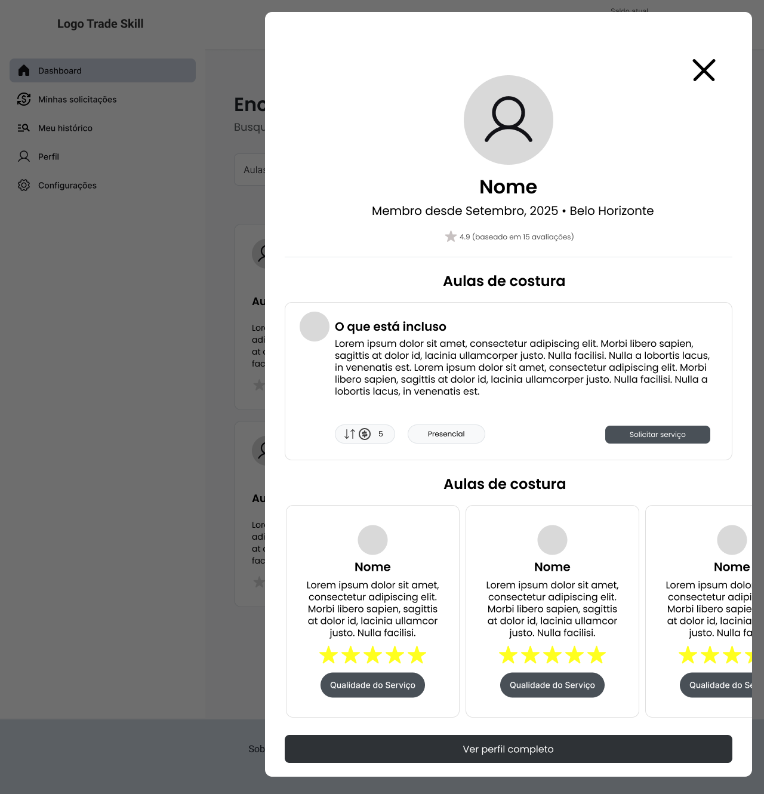|
|:--------------------------------------------------------------------------------------------:|
| **Figura 11: Tela Inicial - Visualização de perfis**   

| **Componente**               | **Requisitos Atendidos**                                                                 |
|------------------------------|------------------------------------------------------------------------------------------|
| **Tela Inicial - Visualização de perfis**      | RF12: Permitir a visualização de perfis dos outros usuários da plataforma, incluindo suas habilidades, histórico de serviços prestados, com o valor de créditos sugerido e avaliações dos consumidores.  RF13: Permitir clicar no botão "solicitar serviço" para iniciar a negociação com o provedor.|

### Tela de histórico de transações

|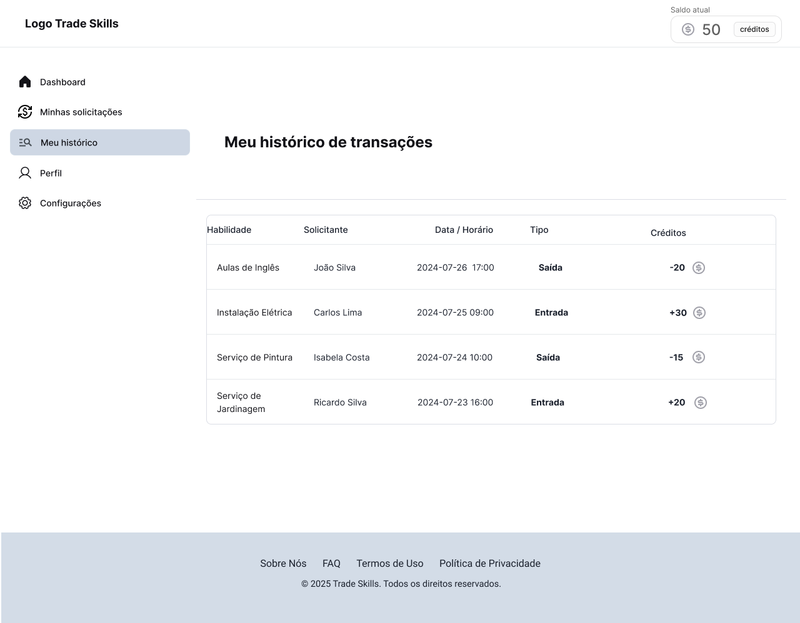|
|:--------------------------------------------------------------------------------------------:|
| **Figura 12: Tela de histórico de transações**   

| **Componente**               | **Requisitos Atendidos**                                                                 |
|------------------------------|------------------------------------------------------------------------------------------|
| **Tela de histórico de transações**              | RF10: Permitir a visualização do histórico de transações, que contêm os valores de entrada e saída de créditos, incluindo data, horário, nome do serviço prestado e nome do provedor ou consumidor.|

### Tela Minhas Solicitações - Pedidos recebidos

|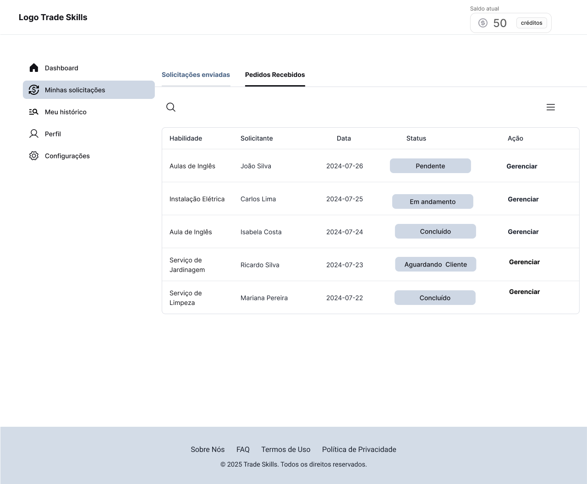|
|:--------------------------------------------------------------------------------------------:|
| **Figura 13: Tela Minhas Solicitações - Pedidos recebidos**   

| **Componente**               | **Requisitos Atendidos**                                                                 |
|------------------------------|------------------------------------------------------------------------------------------|
| **Tela Minhas Solicitações - Pedidos recebidos**  | RF17: Permitir a visualização e o gerenciamento de todos os pedidos recebidos, incluindo nome da habilidade, nome do solicitante e status atual.|

### Tela Minhas Solicitações - Pop Up de visualização do pedido recebido

|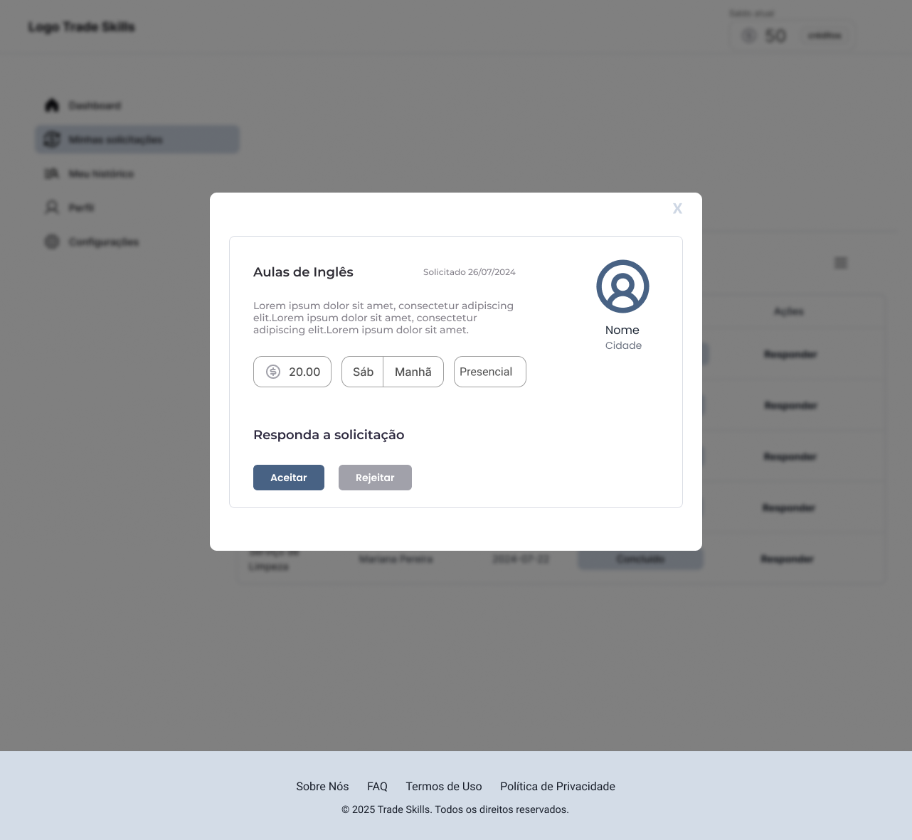|
|:--------------------------------------------------------------------------------------------:|
| **Figura 14: Tela Minhas Solicitações - Pop Up de visualização do pedido recebido**   

| **Componente**               | **Requisitos Atendidos**                                                                 |
|------------------------------|------------------------------------------------------------------------------------------|
| **Tela Minhas Solicitações - Pop Up de visualização do pedido recebido**  | RF16: Permitir que o usuário aceite ou rejeite uma solicitação de serviço, a fim de atualizar o status atual do pedido.|

### Tela Minhas Solicitações - Solicitações enviadas

|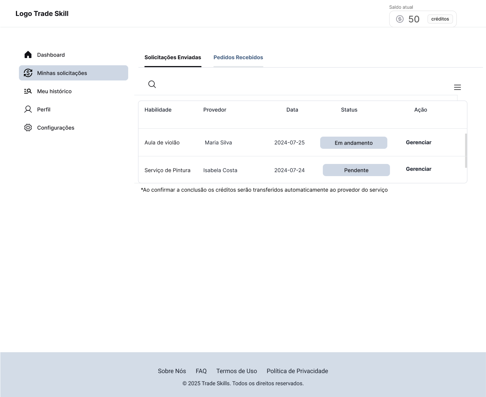|
|:--------------------------------------------------------------------------------------------:|
| **Figura 15: Minhas Solicitações - Solicitações enviadas**   

| **Componente**               | **Requisitos Atendidos**                                                                 |
|------------------------------|------------------------------------------------------------------------------------------|
| **Minhas Solicitações - Solicitações enviadas**  | RF15: Permitir a visualização e o gerenciamento de todas as solicitações enviadas, incluindo nome da habilidade, nome do provedor e status atual.|

### Tela Minhas Solicitações - Pop Up de visualização da solicitação enviada

|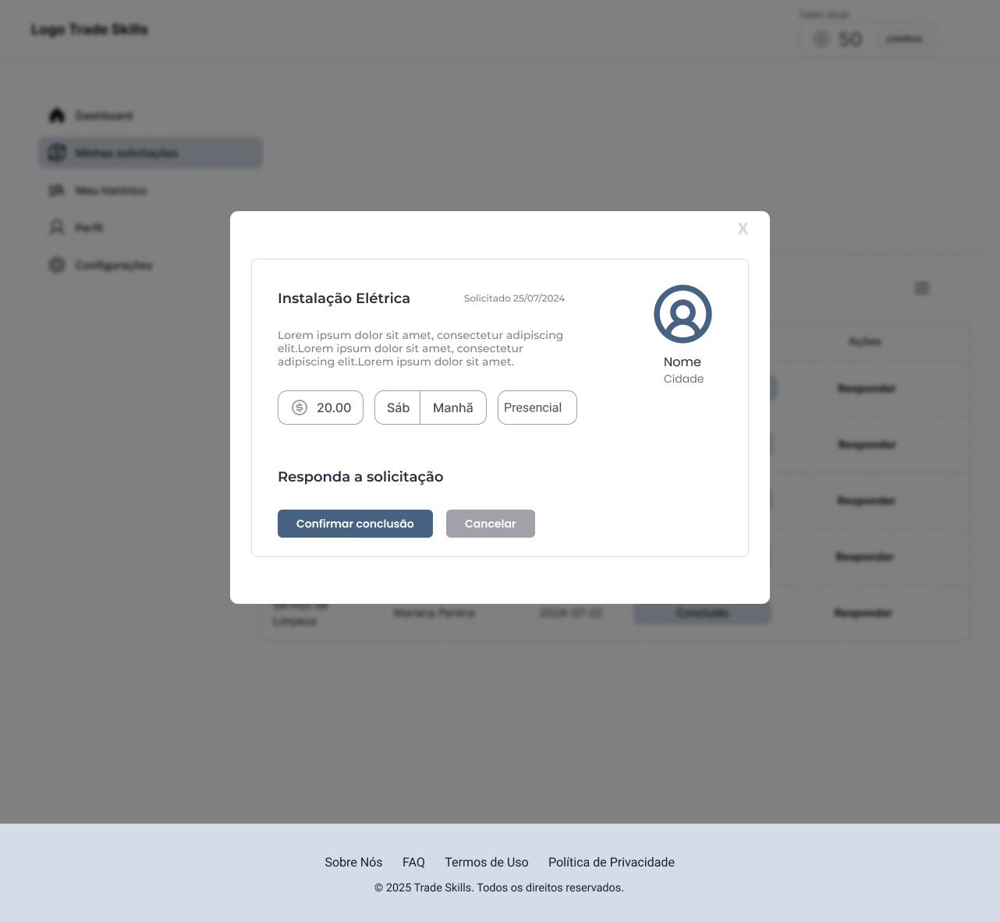|
|:--------------------------------------------------------------------------------------------:|
| **Figura 16: Tela Minhas Solicitações - Pop Up de visualização da solicitação enviada**   

| **Componente**               | **Requisitos Atendidos**                                                                 |
|------------------------------|------------------------------------------------------------------------------------------|
| **Tela Minhas Solicitações - Pop Up de visualização da solicitação enviada**  | RF18: Após o provedor aceitar a solicitação de serviço, o sistema deve permitir que o consumidor consiga cancelar sua solicitação de serviço, com a opção de adicionar uma justificativa.  RF19: Permitir a confirmação da conclusão do serviço.   RF20: Após a confirmação da conclusão do serviço, por parte do consumidor, o sistema deve transferir automaticamente os créditos da conta do usuário consumidor para a do usuário provedor e atualizar o histórico de transações de ambas as contas.|

### Tela Minhas Solicitações - Avaliação 

|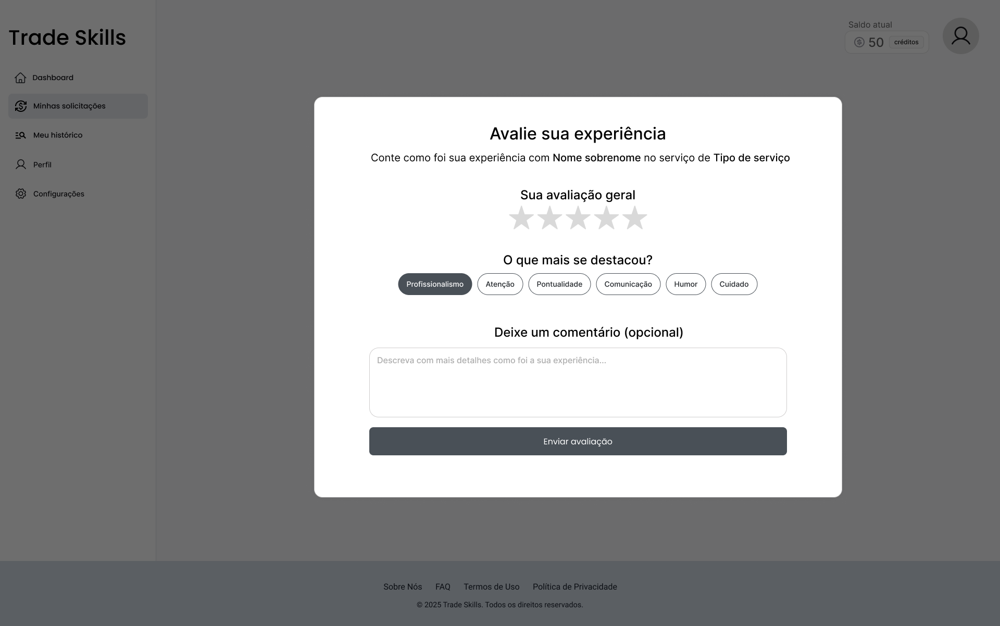|
|:--------------------------------------------------------------------------------------------:|
| **Figura 17: Minhas Solicitações - Avaliação**   

| **Componente**               | **Requisitos Atendidos**                                                                 |
|------------------------------|------------------------------------------------------------------------------------------|
| **Minhas Solicitações - Avaliação**  | RF21: Permitir que o consumidor consiga avaliar o serviço prestado pelo provedor.  RF22: Permitir que o provedor consiga avaliar a conduta do consumidor, durante a execução do serviço.|
